<h1 align="center">🚢 Enterprise AKS Platform</h1>

<p align="center">
  <em>A multi-environment Azure Kubernetes platform, built from scratch with Terraform — one concept at a time.</em>
</p>

<p align="center">
  
  
  
  
  
</p>

---

## 📌 What this is

An Azure platform-engineering project that provisions a **multi-environment AKS setup** using reusable Terraform modules, remote state in Azure Storage, and Azure DevOps pipelines.

Every line is written by hand rather than copied from a template — the goal is to *understand* Terraform, Azure networking, AKS, and CI/CD, not just to make `terraform apply` succeed. Where something bit me, it's documented in [Lessons learned](#-lessons-learned) instead of quietly fixed.

**Working today:** 7 Terraform modules · 2 isolated environments · remote state with locking · secrets in Key Vault · CI/CD with OIDC federation, gated `apply`, and a confirmation-guarded destroy pipeline
**Next up:** ACR and a sample workload on the cluster

---

## 🏗️ Architecture


How Terraform actually wires it together — every arrow is a real dependency in the graph:

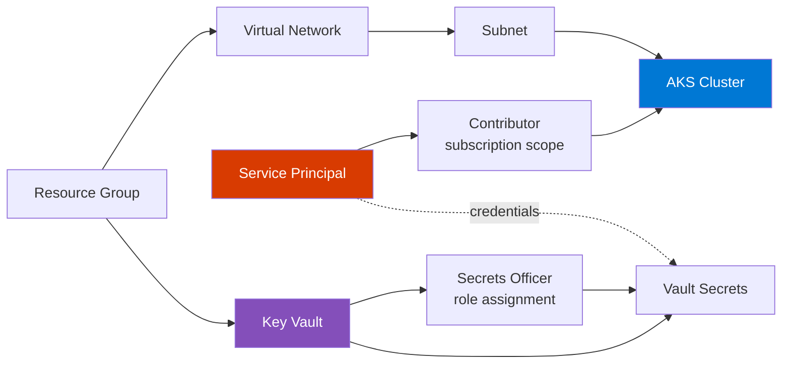

The dependencies are **implicit** — they come from modules referencing each other's outputs, not from `depends_on`. The only two explicit `depends_on` blocks exist because Azure RBAC has to land *before* the resource that needs it, and Terraform can't infer that from data flow alone.

---

## 🧰 Tech stack

| | Technology | Role |
|---|---|---|
| 🐙 | **GitHub** | Public source repository |
| 🔄 | **Azure DevOps** | CI/CD pipelines and approval gates |
| 🏗️ | **Terraform** | Infrastructure as Code (azurerm `~> 4.0`, azuread `~> 3.0`) |
| ☁️ | **Azure** | Cloud platform |
| ☸️ | **AKS** | Managed Kubernetes, Azure CNI Overlay |
| 🔐 | **Azure Key Vault** | Secret storage, RBAC authorization model |
| 🌐 | **Azure VNet** | Network isolation per environment |
| 💾 | **Azure Storage** | Remote Terraform state + blob-lease locking |
| ⚡ | **Azure CLI** | Backend bootstrap |
| 🐚 | **Bash / PowerShell** | Supporting scripts |

---

## 📂 Repository layout

```text
Enterprise-Aks-Platform/
├── environments/
│   ├── dev/                  # dev values → dev state
│   └── staging/              # staging values → staging state
├── modules/
│   ├── aks/
│   ├── key-vault/
│   ├── resource-group/
│   ├── service-principal/
│   ├── storage-account/
│   ├── subnet/
│   └── vnet/
├── scripts/
│   └── init.sh               # bootstraps the state backend
├── screenshots/
├── azure-pipelines.yml       # CI/CD: fmt, validate, plan, gated apply
├── azure-pipelines-destroy.yml  # manual only, confirmation + approval
├── architecture.png
├── .gitattributes            # LF endings for Linux pipeline agents
├── .gitignore
└── README.md
```

---

## 🧩 Terraform modules

Each module owns **one** resource, exposes flat variables, and ships with a `tests/` harness for standalone smoke testing.

| Module | Creates | Notable choices |
|---|---|---|
| [`resource-group`](modules/resource-group/) | `azurerm_resource_group` | No default name or location — an accidental `apply` shouldn't invent resources |
| [`vnet`](modules/vnet/) | `azurerm_virtual_network` | Address space driven entirely by the environment |
| [`subnet`](modules/subnet/) | `azurerm_subnet` | A single `/24` is enough thanks to CNI Overlay |
| [`storage-account`](modules/storage-account/) | `azurerm_storage_account` | HTTPS-only, TLS 1.2, no anonymous blob access |
| [`service-principal`](modules/service-principal/) | App registration + SP + password | The secret lands in state, which is *why* state is remote and private |
| [`key-vault`](modules/key-vault/) | `azurerm_key_vault` | RBAC model, not legacy access policies |
| [`aks`](modules/aks/) | `azurerm_kubernetes_cluster` | Service-principal auth, Azure CNI Overlay, `172.16.0.0/16` service CIDR |

```text
modules/<name>/
├── main.tf
├── variables.tf
├── outputs.tf
├── versions.tf
└── tests/          # standalone: init → validate → plan → apply
```

---

## 🌍 Environments

`main.tf`, `providers.tf`, and `variables.tf` are **byte-identical** between dev and staging. That's the entire point of the module layout — the architecture is defined once, and an environment is just a set of values.

Only four things actually differ:

| | 🧪 dev | 🎭 staging |
|---|---|---|
| State storage account | `tfdevbackend2026ashish` | `tfstagebackend2026ashish` |
| State key | `dev.terraform.tfstate` | `staging.terraform.tfstate` |
| `environment` | `dev` | `staging` |
| Network | `10.0.0.0/16` → `10.0.1.0/24` | `10.1.0.0/16` → `10.1.1.0/24` |

Which produces two completely separate stacks:

| dev | staging |
|---|---|
| `platform-dev-rg` | `platform-staging-rg` |
| `platform-dev-vnet` / `-subnet` | `platform-staging-vnet` / `-subnet` |
| `platform-dev-aks` | `platform-staging-aks` |
| `platform-dev-kv-19bd` | `platform-staging-kv-19bd` |
| `platform-dev-sp` | `platform-staging-sp` |

**Three kinds of isolation fall out of this:**

- 🗄️ **Separate state** — a `destroy` in staging physically cannot touch dev; Terraform doesn't know it exists.
- 🔑 **Separate service principals** — a leaked staging credential grants nothing in dev.
- 🌐 **Non-overlapping CIDRs** — not required while the vnets are unconnected, but overlapping ranges can't be routed the moment you peer them, and renumbering a live vnet means recreating everything in it.

> **Honest note:** staging is currently a naming-and-state clone of dev — same node count, same SKU tier, no purge protection. The real dev-vs-staging difference will be the **approval gate** in the pipeline, not the Terraform.

---

## 🔐 How secrets are handled

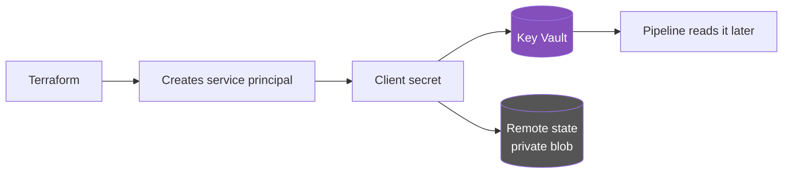

- The SP client secret is written to Key Vault and **deliberately not exposed as a Terraform output**.
- It *does* live in state — unavoidable — which is exactly why state sits in a private Azure Storage container rather than on a laptop.
- The vault uses the **RBAC** authorization model, so creating a vault grants you nothing. Terraform assigns itself `Key Vault Secrets Officer` before writing.
- `*tfplan*` is gitignored: saved plan files embed sensitive values in plaintext.

---

## 🚀 Running it locally

### 1️⃣ Bootstrap the state backend

The state store is created **outside** Terraform to avoid a chicken-and-egg dependency.

```bash
bash scripts/init.sh
```

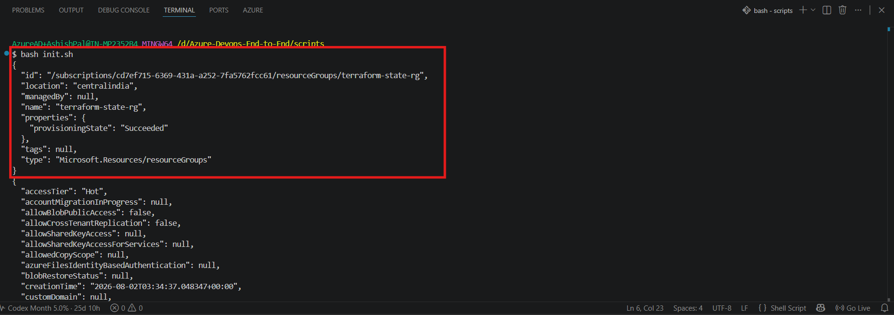

Creates `terraform-state-rg`, one storage account per environment, and a `tfstate` container in each.

### 2️⃣ Initialize

```bash
cd environments/dev
terraform init
```

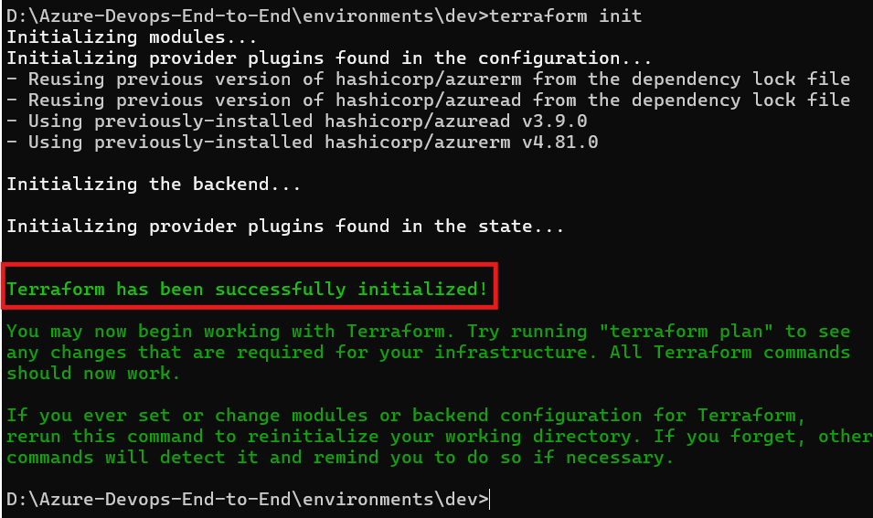

### 3️⃣ Format and validate

```bash
terraform fmt -recursive
terraform validate
```

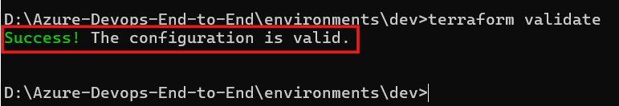

### 4️⃣ Plan

```bash
terraform plan
```

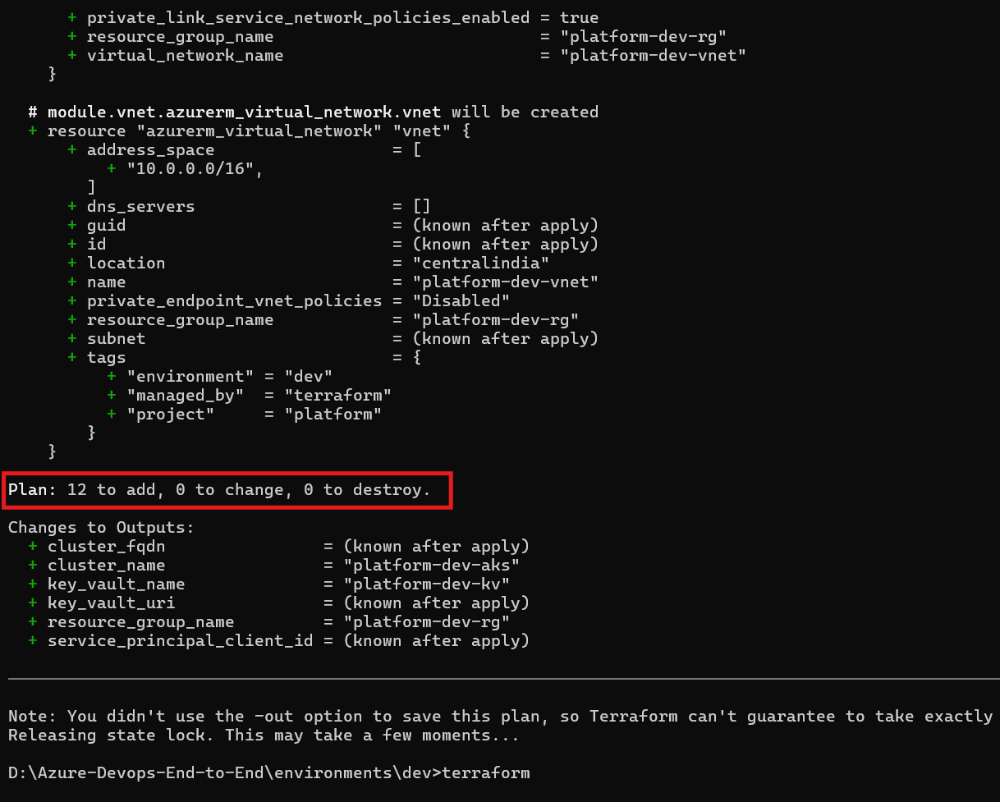

12 resources: resource group, vnet, subnet, service principal (×4 Entra objects), 2 role assignments, Key Vault, 2 secrets, and the cluster.

### 5️⃣ Apply

```bash
terraform apply
```

The service principal appears in Entra ID:

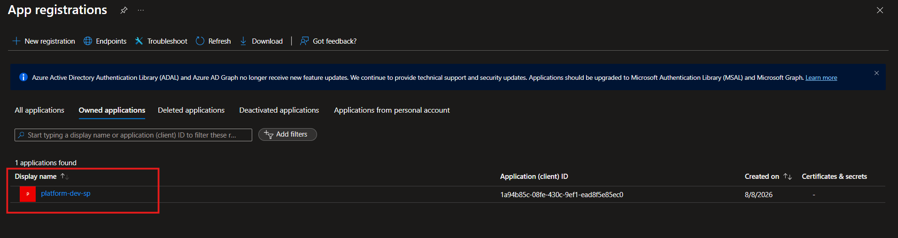

And its credentials land in Key Vault — names only, values stay hidden:

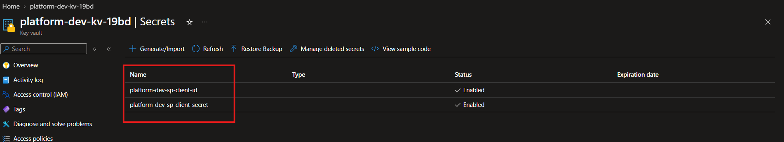

### 6️⃣ Verify the cluster

```bash
az aks get-credentials --resource-group platform-dev-rg --name platform-dev-aks
kubectl get nodes
kubectl get pods -A
```

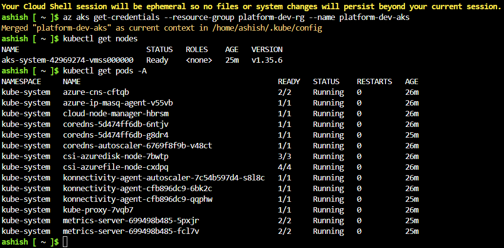

The `azure-cns` and `azure-ip-masq-agent` pods are the proof that **CNI Overlay** is active — the masq agent only appears in overlay mode. `konnectivity-agent` running means the node successfully registered with the managed control plane.

### 7️⃣ Tear it down

```bash
terraform destroy
```

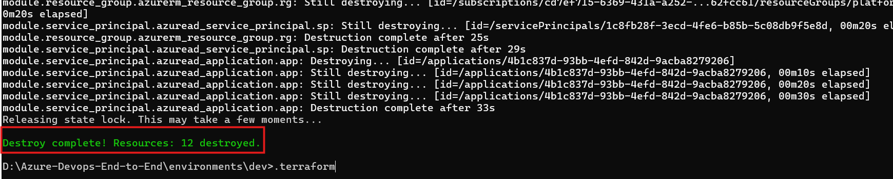

> 💸 An idle AKS node bills by the hour. Destroy when you're done experimenting.

---

## 🔄 CI/CD pipeline

[`azure-pipelines.yml`](azure-pipelines.yml) runs on every push to `main`. GitHub stays the source of truth; Azure DevOps only supplies pipelines, environments, and approvals.

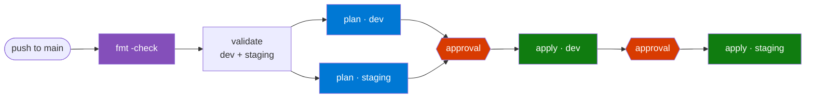

**Four stages, split by whether they need credentials and whether they change anything.**

`validate` runs `fmt -check` first because it costs nothing and catches the cheapest class of mistake. Then `terraform init -backend=false && terraform validate` for both environments. The `-backend=false` matters: validate only needs provider *schemas*, not remote state, so the whole stage runs **without touching Azure at all**. Broken HCL is caught for free.

`plan` depends on `validate`, so it never runs against code that couldn't compile. One job per environment, both read-only.

`apply_dev` and `apply_staging` are gated. Staging depends on dev, so a change that breaks dev can never reach staging — the promotion chain is enforced by the dependency, not by convention.

### Authentication — no secrets anywhere

The service connection uses **workload identity federation with OIDC**, so nothing needs storing or rotating:

```yaml
- task: AzureCLI@2
  inputs:
    azureSubscription: azure-sub-connection
    addSpnToEnvironment: true      # exposes the federated identity to the shell
    inlineScript: |
      export ARM_USE_OIDC=true
      export ARM_CLIENT_ID="$servicePrincipalId"
      export ARM_OIDC_TOKEN="$idToken"
      export ARM_TENANT_ID="$tenantId"
      export ARM_SUBSCRIPTION_ID=`az account show --query id --output tsv`
```

`$idToken` is a short-lived token minted per run. Those four `ARM_*` variables are the entire contract between Azure DevOps and the azurerm provider.

Two non-obvious details in there:

- **Backticks, not `$(...)`.** Azure DevOps treats `$(...)` as its own macro syntax and expands it before bash ever sees it, so command substitution has to use backticks.
- **`ARM_SUBSCRIPTION_ID` is mandatory.** azurerm 4.x requires an explicit subscription; it can no longer infer one.

### Permissions the pipeline identity needs

Azure DevOps creates the service connection with **Contributor** and nothing else. That is not enough:

| Grant | Why | Failure without it |
|---|---|---|
| **User Access Administrator** | The config creates subscription-scoped role assignments | `AuthorizationFailed` |
| Graph **`Application.ReadWrite.OwnedBy`** + admin consent | The config creates an Entra app registration | `Insufficient privileges` |

Azure RBAC and Entra directory permissions are **separate systems** — no RBAC role, including Owner, grants the ability to create app registrations.

### Environments and approval gates

`dev` and `staging` exist as Azure DevOps **Environments**, each with an approval check. Approvals attach to environments, which is why apply stages must be `deployment` jobs rather than plain `job`s.

Both environments are gated, including `dev` — which departs from the usual "dev auto-applies" pattern on purpose. `trigger: main` means every push would otherwise spin up a real AKS cluster that bills until someone remembers it. A gate on `dev` keeps teardown deliberate.

> ⚠️ **Ordering hazard:** a `deployment` job auto-creates its environment, but **not** its approvals. Push apply stages before configuring approvals and the first run applies ungated.

### Why the apply stages re-plan

The textbook pattern is `plan -out=tfplan` → publish as a pipeline artifact → `apply tfplan`, guaranteeing you apply exactly what was reviewed. This project doesn't, because a saved plan file embeds the service principal's client secret **in plaintext** — the same reason `*tfplan*` is gitignored. Publishing it as an artifact would park a live credential in Azure DevOps.

The trade-off is a window between the plan you read and the apply you approve. Acceptable for a single operator; in a team you would solve the secret-handling problem instead.

---

## 🧨 Destroy pipeline

[`azure-pipelines-destroy.yml`](azure-pipelines-destroy.yml) tears down one environment on demand. This is a learning platform, so environments are meant to be disposable — an idle AKS node bills by the hour whether you are using it or not.

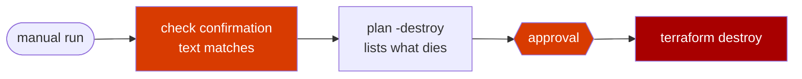

It is a **separate pipeline file** rather than a parameter on the CI pipeline. One file that both auto-triggers on push and can destroy is one templating mistake away from a very bad afternoon.

### Four independent safety layers

| Layer | Mechanism |
|---|---|
| Cannot be triggered by code | `trigger: none` and `pr: none` — manual runs only |
| Cannot target the wrong thing | `environment` is a constrained choice: `dev` or `staging` |
| Cannot run by accident | You must **retype the environment name**, checked as the very first step |
| Cannot run unwitnessed | Bound to the same gated environment, so it needs an approval click |

The confirmation check runs before Terraform is even installed, so a mistyped run costs nothing:

```yaml
- script: |
    if [ "${{ parameters.confirm }}" != "${{ parameters.environment }}" ]; then
      echo "Confirmation did not match."
      exit 1
    fi
  displayName: Check confirmation
```

### Preview before the gate

The `preview` stage runs `terraform plan -destroy` **before** the approval. So the approver reads a concrete list — `Plan: 0 to add, 0 to change, 12 to destroy` — rather than trusting the pipeline's name. Approving a list beats approving an intention.

### Running it

> **Pipelines → ⚠️ Destroy environment → Run pipeline**

| Parameter | Value |
|---|---|
| Environment to destroy | `dev` |
| Type the environment name again to confirm | `dev` |

Takes 10–15 minutes; AKS deletion is the slow part. Two things it handles that are easy to overlook:

- **The Key Vault is purged, not just soft-deleted.** azurerm defaults `purge_soft_delete_on_destroy` to true, so the vault name is immediately reusable instead of being locked for the 7-day retention window.
- **The Entra app registration is deleted too.** The pipeline identity created `platform-dev-sp`, so it owns it and is allowed to remove it.

Verify you are back to zero:

```bash
az group list --query "[?starts_with(name,'platform-')].name" -o table
```

Empty output means only `terraform-state-rg` remains, which costs cents per month.

---

## 🗺️ Roadmap

| Phase | Status | |
|---|---|---|
| 1. Repository & project setup | ✅ | GitHub repo, structure, `.gitignore`, architecture diagram |
| 2. Terraform modules | ✅ | 7 modules, each smoke-tested standalone |
| 3. Environment configuration | ✅ | dev + staging composing the same modules |
| 4. Remote Terraform state | ✅ | Azure Storage backend, one state file per environment |
| 5. Local validation | ✅ | init → fmt → validate → plan → apply → destroy, end to end |
| 6. Azure DevOps pipeline | ✅ | OIDC service connection, `fmt` → `validate` → `plan` → gated `apply`, dev deployed by pipeline |
| 7. Multi-environment promotion | ✅ | Staging gated behind dev, plus a manual-only destroy pipeline |
| 8. Application delivery | 🔜 | ACR, a sample workload, then Argo CD |

---

## 🔮 Future expansion

<details>
<summary><strong>Beyond infrastructure — click to expand</strong></summary>

### Azure Container Registry
Container image storage, wired to AKS so the kubelet identity can pull without credentials.

### Kubernetes application deployment
Manifests or a Helm chart deploying a sample app to the cluster.

### Argo CD and GitOps
Introduced only *after* the imperative deployment workflow is understood, so the value of declarative sync is obvious rather than assumed.

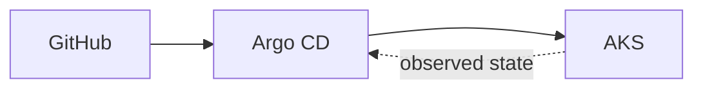

### Monitoring and security
Azure Monitor · Log Analytics · Diagnostic Settings · Workload Identity · Key Vault CSI driver · Kubernetes RBAC · Azure RBAC

### Target architecture

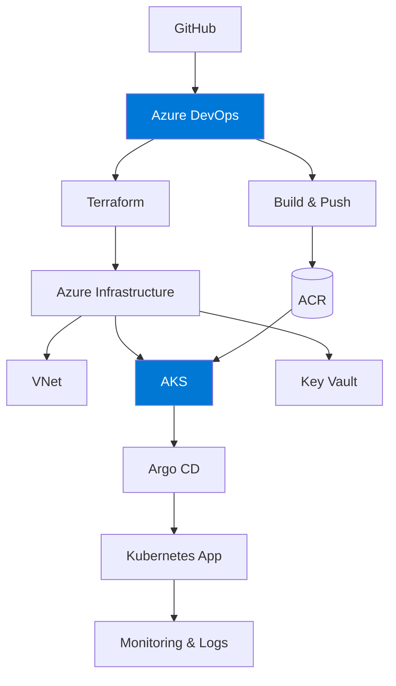

</details>

---

## 💡 Lessons learned

Things that cost real debugging time. Kept here because they're the actual value of building this by hand.

<details>
<summary><strong>🖥️ VM size availability is two independent gates</strong></summary>

Quota and SKU availability are **separate** checks, and B-series failed one or the other on every family:

| Family | Quota | SKUs |
|---|---|---|
| `Standard BS` | 10 ✅ | all `NotAvailableForSubscription` ❌ |
| `Standard Bsv2` / `Basv2` / `Bpsv2` | 0 ❌ | available ✅ |

`az vm list-sizes` is deprecated and **does not report subscription restrictions** — it will happily tell you a SKU exists that you cannot deploy. Use `az vm list-skus` and read `restrictions[].reasonCode`. Landed on `Standard_D2s_v3`.

Also: AKS system node pools require **≥ 2 vCPU / 4 GB**, which rules out `B1s` and `B1ms` regardless of availability.
</details>

<details>
<summary><strong>🔑 Key Vault names are globally unique — and the availability check lies</strong></summary>

`az keyvault check-name` reported `platform-dev-kv` as available. `terraform apply` then failed with `VaultAlreadyExists (409)` because the name is held in **another tenant**. `az keyvault list-deleted` was empty, so purging wasn't an option either.

Fix: a short suffix on the vault name only. Note the hard **24-character** ceiling — `platform-staging-kv-19bd` sits at exactly 24.
</details>

<details>
<summary><strong>⏱️ Entra ID replication lag breaks fresh service principals</strong></summary>

Creating an SP and immediately assigning it a role, or handing it to AKS, can fail with `PrincipalNotFound` or `ServicePrincipalNotFound` — the principal exists but hasn't replicated. Same for a 403 writing a secret straight after granting `Key Vault Secrets Officer`: `depends_on` guarantees *ordering*, not *propagation*.

Re-running `terraform apply` picks up exactly where it stopped. Normal for first-time SP → AKS applies.
</details>

<details>
<summary><strong>📉 Undeclared defaults become permanent phantom drift</strong></summary>

Azure sets `upgrade_settings { max_surge = "10%" }` on node pools itself. With the block absent from the module, every `plan` proposed removing it and Azure would immediately re-add it — drift forever. Declaring it explicitly gives a clean `0 to change`.
</details>

<details>
<summary><strong>🌐 The default service CIDR overlaps the VNet</strong></summary>

AKS defaults its service CIDR to `10.0.0.0/16` — exactly the dev VNet address space — which fails at apply with a confusing overlap error. The module pins `172.16.0.0/16` with `dns_service_ip = 172.16.0.10`.

CNI Overlay also keeps pod IPs off the node subnet entirely, so a single `/24` per environment is plenty instead of the large subnet traditional Azure CNI demands.
</details>

<details>
<summary><strong>🔤 Line endings and filenames bite cross-platform</strong></summary>

`.gitattributes` forces LF on `*.sh`, because a CRLF shell script on a Linux pipeline agent fails with `bad interpreter`.

Emoji in filenames render fine on GitHub (it percent-encodes them automatically) — but a **space** in a filename silently breaks the markdown image, emitting literal text instead of an ``. Verified against GitHub's markdown API.
</details>

<details>
<summary><strong>📥 Importing a GitHub repo into Azure Repos is a snapshot, not a sync</strong></summary>

Importing looked like "connecting" the two, but it's a **one-time copy**. Days later the Azure Repos copy still sat at the initial commit while GitHub had a dozen more, with nothing to warn me.

Worth deciding early: whichever repo the pipeline builds from becomes the real source of truth. Pointing the pipeline at GitHub means forgetting to push the mirror is harmless. Pointing it at the mirror means the public repo can silently rot.

Azure DevOps has no native pull-sync from GitHub, so a second remote plus two pushes is the only honest way to keep both current:

```bash
git remote set-url --add --push origin <github-url>
git remote set-url --add --push origin <azure-repos-url>
```
</details>

<details>
<summary><strong>🔑 A service connection needs two permission systems, not one</strong></summary>

The single biggest time sink. Azure DevOps creates the connection with **Contributor** on the subscription, which is not enough for this config:

- Contributor **cannot manage role assignments** — needed for the subscription-scoped `azurerm_role_assignment`. Fix: add **User Access Administrator** (or use Owner).
- **No Azure RBAC role grants directory permissions.** Creating an Entra app registration needs Microsoft Graph `Application.ReadWrite.OwnedBy` as an *application* permission, plus admin consent.

Azure RBAC governs resources; Entra governs the directory. Being Owner of a subscription grants nothing in the directory, and the resulting error (`Insufficient privileges to complete the operation`) says nothing about which system refused you.
</details>

<details>
<summary><strong>🧩 Admin consent is a separate step, and it can't be done from Cloud Shell</strong></summary>

Three traps stacked on top of each other:

1. `az ad app permission add` only **requests** a permission. Nothing works until consent is granted — and an unconsented permission fails identically to one that was never added.
2. The CLI then suggests `az ad app permission grant`, which is for **delegated** permissions. Application permissions need `admin-consent`. Following the hint creates a grant that does nothing.
3. `az ad app permission admin-consent` **fails in Cloud Shell** with *"not a supported MSI token audience"*. It calls a legacy Azure AD portal API that only accepts an interactive user token, and Cloud Shell authenticates as a managed identity.

Do consent in the portal, where you also get visual confirmation the CLI's silent success doesn't give you.
</details>

<details>
<summary><strong>🔢 Graph app role GUIDs must be looked up, never remembered</strong></summary>

A wrong GUID produces `Claim is invalid: <guid> does not exist on resource application 00000003-…`. The portal also stops resolving the friendly name and shows the raw GUID — that's the tell.

Look it up from your own tenant rather than trusting any source:

```bash
az ad sp show --id 00000003-0000-0000-c000-000000000000 \
  --query "appRoles[?value=='Application.ReadWrite.OwnedBy']"
```

Better still, use the portal's permission picker — it can only emit valid IDs. And beware the neighbours: `AppRoleAssignment.ReadWrite.All` ("manage app role assignments") and `Application.ReadWrite.All` ("read and write all applications") sit next to `Application.ReadWrite.OwnedBy` and sound nearly identical. Only the last is least-privilege for creating your own apps.
</details>

<details>
<summary><strong>🏢 A personal-account Azure DevOps org can't create service connections</strong></summary>

The automatic service connection failed with *"The string must have at least one non-white-space character. Parameter name: tenantid"* — the org was backed by a personal Microsoft account, so there was no Entra tenant to resolve.

Symptom of the same root cause: installing the Azure Pipelines GitHub App landed on a blank page showing **"Anonymous"**, because the marketplace acquisition flow (`aex.dev.azure.com/signup/github`) needs an unambiguous signed-in identity.

Fix: **Organization settings → Microsoft Entra → Connect directory.** Note it forces every user to sign out, and any member not native to the target directory goes through identity mapping on next sign-in. It also invalidates cached Git credentials, so pushes to Azure Repos need re-authentication afterwards.
</details>

<details>
<summary><strong>🟥 Red squiggles on marketplace tasks are your editor, not the pipeline</strong></summary>

`TerraformInstaller@1` shows as *"Value is not accepted"* with a huge list of valid values in VS Code. That list contains only Microsoft's **built-in** tasks — the extension validates against a static schema and has no idea which marketplace extensions your organization has installed.

The pipeline resolves the task fine. Point the Azure Pipelines extension at your organization if you want the warnings gone.
</details>

<details>
<summary><strong>📦 Deployment jobs do not clone your repository</strong></summary>

Approvals only attach to Azure DevOps **environments**, and only a `deployment` job can bind to one. So any stage that needs a gate has to be a `deployment` job rather than a plain `job` — which brings two surprises:

- A `deployment` job does **not** check out source by default. Without an explicit `- checkout: self` the agent has no repo, and the error complains about missing configuration rather than a missing clone.
- The nesting is deeper: `deployment → strategy → runOnce → deploy → steps`.

The gate is worth the ceremony, but the silent no-checkout is the kind of thing that costs an hour the first time.
</details>

---

## 🧠 Engineering principles

- Infrastructure is defined as code — no portal clicking.
- Environments stay isolated: separate state, separate identities, separate networks.
- Modules own one resource and stay reusable.
- Secrets are never hardcoded and never output.
- State lives remotely, always.
- Everything is validated locally before it's automated.
- New components are added only once the underlying concept is understood.

---

<p align="center">
  <sub>Built as a hands-on Azure platform engineering project — infrastructure first, GitOps eventually.</sub>
</p>
