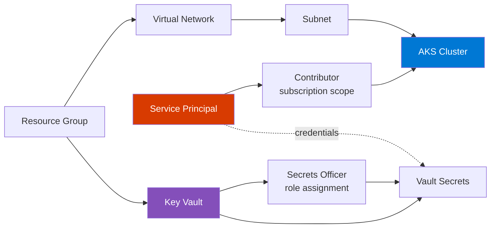
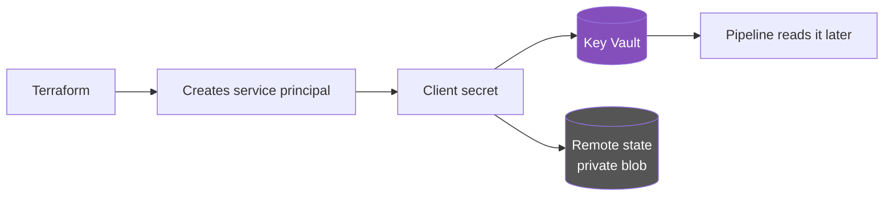
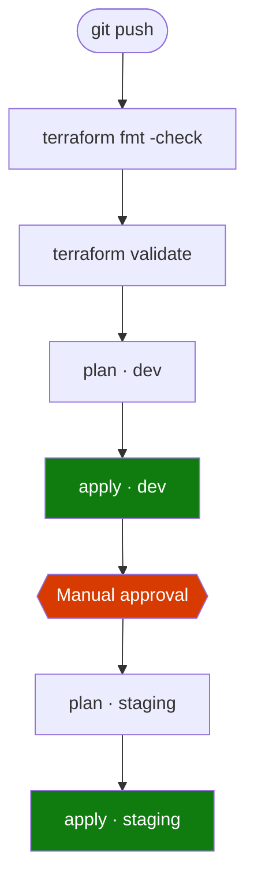
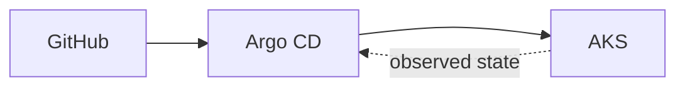
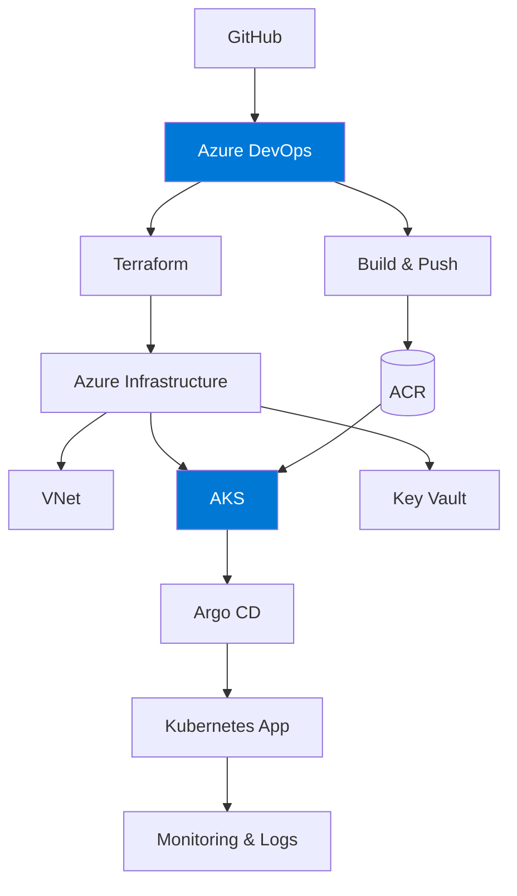

<h1 align="center">🚢 Enterprise AKS Platform</h1>

<p align="center">
  <em>A multi-environment Azure Kubernetes platform, built from scratch with Terraform — one concept at a time.</em>
</p>

<p align="center">
  
  
  
  
  
</p>

---

## 📌 What this is

An Azure platform-engineering project that provisions a **multi-environment AKS setup** using reusable Terraform modules, remote state in Azure Storage, and (soon) Azure DevOps pipelines.

Every line is written by hand rather than copied from a template — the goal is to *understand* Terraform, Azure networking, AKS, and CI/CD, not just to make `terraform apply` succeed. Where something bit me, it's documented in [Lessons learned](#-lessons-learned) instead of quietly fixed.

**Working today:** 7 Terraform modules · 2 isolated environments · remote state with locking · service-principal auth · secrets in Key Vault
**Next up:** `azure-pipelines.yml`

---

## 🏗️ Architecture


How Terraform actually wires it together — every arrow is a real dependency in the graph:



The dependencies are **implicit** — they come from modules referencing each other's outputs, not from `depends_on`. The only two explicit `depends_on` blocks exist because Azure RBAC has to land *before* the resource that needs it, and Terraform can't infer that from data flow alone.

---

## 🧰 Tech stack

| | Technology | Role |
|---|---|---|
| 🐙 | **GitHub** | Public source repository |
| 🔄 | **Azure DevOps** | CI/CD pipelines and approval gates |
| 🏗️ | **Terraform** | Infrastructure as Code (azurerm `~> 4.0`, azuread `~> 3.0`) |
| ☁️ | **Azure** | Cloud platform |
| ☸️ | **AKS** | Managed Kubernetes, Azure CNI Overlay |
| 🔐 | **Azure Key Vault** | Secret storage, RBAC authorization model |
| 🌐 | **Azure VNet** | Network isolation per environment |
| 💾 | **Azure Storage** | Remote Terraform state + blob-lease locking |
| ⚡ | **Azure CLI** | Backend bootstrap |
| 🐚 | **Bash / PowerShell** | Supporting scripts |

---

## 📂 Repository layout

```text
Enterprise-Aks-Platform/
├── environments/
│   ├── dev/                  # dev values → dev state
│   └── staging/              # staging values → staging state
├── modules/
│   ├── aks/
│   ├── key-vault/
│   ├── resource-group/
│   ├── service-principal/
│   ├── storage-account/
│   ├── subnet/
│   └── vnet/
├── scripts/
│   └── init.sh               # bootstraps the state backend
├── screenshots/
├── architecture.png
├── .gitattributes            # LF endings for Linux pipeline agents
├── .gitignore
└── README.md
```

---

## 🧩 Terraform modules

Each module owns **one** resource, exposes flat variables, and ships with a `tests/` harness for standalone smoke testing.

| Module | Creates | Notable choices |
|---|---|---|
| [`resource-group`](modules/resource-group/) | `azurerm_resource_group` | No default name or location — an accidental `apply` shouldn't invent resources |
| [`vnet`](modules/vnet/) | `azurerm_virtual_network` | Address space driven entirely by the environment |
| [`subnet`](modules/subnet/) | `azurerm_subnet` | A single `/24` is enough thanks to CNI Overlay |
| [`storage-account`](modules/storage-account/) | `azurerm_storage_account` | HTTPS-only, TLS 1.2, no anonymous blob access |
| [`service-principal`](modules/service-principal/) | App registration + SP + password | The secret lands in state, which is *why* state is remote and private |
| [`key-vault`](modules/key-vault/) | `azurerm_key_vault` | RBAC model, not legacy access policies |
| [`aks`](modules/aks/) | `azurerm_kubernetes_cluster` | Service-principal auth, Azure CNI Overlay, `172.16.0.0/16` service CIDR |

```text
modules/<name>/
├── main.tf
├── variables.tf
├── outputs.tf
├── versions.tf
└── tests/          # standalone: init → validate → plan → apply
```

---

## 🌍 Environments

`main.tf`, `providers.tf`, and `variables.tf` are **byte-identical** between dev and staging. That's the entire point of the module layout — the architecture is defined once, and an environment is just a set of values.

Only four things actually differ:

| | 🧪 dev | 🎭 staging |
|---|---|---|
| State storage account | `tfdevbackend2026ashish` | `tfstagebackend2026ashish` |
| State key | `dev.terraform.tfstate` | `staging.terraform.tfstate` |
| `environment` | `dev` | `staging` |
| Network | `10.0.0.0/16` → `10.0.1.0/24` | `10.1.0.0/16` → `10.1.1.0/24` |

Which produces two completely separate stacks:

| dev | staging |
|---|---|
| `platform-dev-rg` | `platform-staging-rg` |
| `platform-dev-vnet` / `-subnet` | `platform-staging-vnet` / `-subnet` |
| `platform-dev-aks` | `platform-staging-aks` |
| `platform-dev-kv-19bd` | `platform-staging-kv-19bd` |
| `platform-dev-sp` | `platform-staging-sp` |

**Three kinds of isolation fall out of this:**

- 🗄️ **Separate state** — a `destroy` in staging physically cannot touch dev; Terraform doesn't know it exists.
- 🔑 **Separate service principals** — a leaked staging credential grants nothing in dev.
- 🌐 **Non-overlapping CIDRs** — not required while the vnets are unconnected, but overlapping ranges can't be routed the moment you peer them, and renumbering a live vnet means recreating everything in it.

> **Honest note:** staging is currently a naming-and-state clone of dev — same node count, same SKU tier, no purge protection. The real dev-vs-staging difference will be the **approval gate** in the pipeline, not the Terraform.

---

## 🔐 How secrets are handled



- The SP client secret is written to Key Vault and **deliberately not exposed as a Terraform output**.
- It *does* live in state — unavoidable — which is exactly why state sits in a private Azure Storage container rather than on a laptop.
- The vault uses the **RBAC** authorization model, so creating a vault grants you nothing. Terraform assigns itself `Key Vault Secrets Officer` before writing.
- `*tfplan*` is gitignored: saved plan files embed sensitive values in plaintext.

---

## 🚀 Running it locally

### 1️⃣ Bootstrap the state backend

The state store is created **outside** Terraform to avoid a chicken-and-egg dependency.

```bash
bash scripts/init.sh
```


Creates `terraform-state-rg`, one storage account per environment, and a `tfstate` container in each.

### 2️⃣ Initialize

```bash
cd environments/dev
terraform init
```


### 3️⃣ Format and validate

```bash
terraform fmt -recursive
terraform validate
```


### 4️⃣ Plan

```bash
terraform plan
```


12 resources: resource group, vnet, subnet, service principal (×4 Entra objects), 2 role assignments, Key Vault, 2 secrets, and the cluster.

### 5️⃣ Apply

```bash
terraform apply
```

The service principal appears in Entra ID:


And its credentials land in Key Vault — names only, values stay hidden:


### 6️⃣ Verify the cluster

```bash
az aks get-credentials --resource-group platform-dev-rg --name platform-dev-aks
kubectl get nodes
kubectl get pods -A
```


The `azure-cns` and `azure-ip-masq-agent` pods are the proof that **CNI Overlay** is active — the masq agent only appears in overlay mode. `konnectivity-agent` running means the node successfully registered with the managed control plane.

### 7️⃣ Tear it down

```bash
terraform destroy
```


> 💸 An idle AKS node bills by the hour. Destroy when you're done experimenting.

---

## 🗺️ Roadmap

| Phase | Status | |
|---|---|---|
| 1. Repository & project setup | ✅ | GitHub repo, structure, `.gitignore`, architecture diagram |
| 2. Terraform modules | ✅ | 7 modules, each smoke-tested standalone |
| 3. Environment configuration | ✅ | dev + staging composing the same modules |
| 4. Remote Terraform state | ✅ | Azure Storage backend, one state file per environment |
| 5. Local validation | ✅ | init → fmt → validate → plan → apply → destroy, end to end |
| 6. Azure DevOps pipeline | 🔜 | Service connection, `azure-pipelines.yml`, approval gates |
| 7. Multi-environment promotion | 🔜 | dev auto-applies, staging gated on approval |

### Target pipeline flow



Authentication uses an Azure DevOps **service connection** with workload identity federation — no secrets stored in the pipeline.

---

## 🔮 Future expansion

<details>
<summary><strong>Beyond infrastructure — click to expand</strong></summary>

### Azure Container Registry
Container image storage, wired to AKS so the kubelet identity can pull without credentials.

### Kubernetes application deployment
Manifests or a Helm chart deploying a sample app to the cluster.

### Argo CD and GitOps
Introduced only *after* the imperative deployment workflow is understood, so the value of declarative sync is obvious rather than assumed.



### Monitoring and security
Azure Monitor · Log Analytics · Diagnostic Settings · Workload Identity · Key Vault CSI driver · Kubernetes RBAC · Azure RBAC

### Target architecture



</details>

---

## 💡 Lessons learned

Things that cost real debugging time. Kept here because they're the actual value of building this by hand.

<details>
<summary><strong>🖥️ VM size availability is two independent gates</strong></summary>

Quota and SKU availability are **separate** checks, and B-series failed one or the other on every family:

| Family | Quota | SKUs |
|---|---|---|
| `Standard BS` | 10 ✅ | all `NotAvailableForSubscription` ❌ |
| `Standard Bsv2` / `Basv2` / `Bpsv2` | 0 ❌ | available ✅ |

`az vm list-sizes` is deprecated and **does not report subscription restrictions** — it will happily tell you a SKU exists that you cannot deploy. Use `az vm list-skus` and read `restrictions[].reasonCode`. Landed on `Standard_D2s_v3`.

Also: AKS system node pools require **≥ 2 vCPU / 4 GB**, which rules out `B1s` and `B1ms` regardless of availability.
</details>

<details>
<summary><strong>🔑 Key Vault names are globally unique — and the availability check lies</strong></summary>

`az keyvault check-name` reported `platform-dev-kv` as available. `terraform apply` then failed with `VaultAlreadyExists (409)` because the name is held in **another tenant**. `az keyvault list-deleted` was empty, so purging wasn't an option either.

Fix: a short suffix on the vault name only. Note the hard **24-character** ceiling — `platform-staging-kv-19bd` sits at exactly 24.
</details>

<details>
<summary><strong>⏱️ Entra ID replication lag breaks fresh service principals</strong></summary>

Creating an SP and immediately assigning it a role, or handing it to AKS, can fail with `PrincipalNotFound` or `ServicePrincipalNotFound` — the principal exists but hasn't replicated. Same for a 403 writing a secret straight after granting `Key Vault Secrets Officer`: `depends_on` guarantees *ordering*, not *propagation*.

Re-running `terraform apply` picks up exactly where it stopped. Normal for first-time SP → AKS applies.
</details>

<details>
<summary><strong>📉 Undeclared defaults become permanent phantom drift</strong></summary>

Azure sets `upgrade_settings { max_surge = "10%" }` on node pools itself. With the block absent from the module, every `plan` proposed removing it and Azure would immediately re-add it — drift forever. Declaring it explicitly gives a clean `0 to change`.
</details>

<details>
<summary><strong>🌐 The default service CIDR overlaps the VNet</strong></summary>

AKS defaults its service CIDR to `10.0.0.0/16` — exactly the dev VNet address space — which fails at apply with a confusing overlap error. The module pins `172.16.0.0/16` with `dns_service_ip = 172.16.0.10`.

CNI Overlay also keeps pod IPs off the node subnet entirely, so a single `/24` per environment is plenty instead of the large subnet traditional Azure CNI demands.
</details>

<details>
<summary><strong>🔤 Line endings and filenames bite cross-platform</strong></summary>

`.gitattributes` forces LF on `*.sh`, because a CRLF shell script on a Linux pipeline agent fails with `bad interpreter`.

Emoji in filenames render fine on GitHub (it percent-encodes them automatically) — but a **space** in a filename silently breaks the markdown image, emitting literal text instead of an ``. Verified against GitHub's markdown API.
</details>

---

## 🧠 Engineering principles

- Infrastructure is defined as code — no portal clicking.
- Environments stay isolated: separate state, separate identities, separate networks.
- Modules own one resource and stay reusable.
- Secrets are never hardcoded and never output.
- State lives remotely, always.
- Everything is validated locally before it's automated.
- New components are added only once the underlying concept is understood.

---

<p align="center">
  <sub>Built as a hands-on Azure platform engineering project — infrastructure first, GitOps eventually.</sub>
</p>
