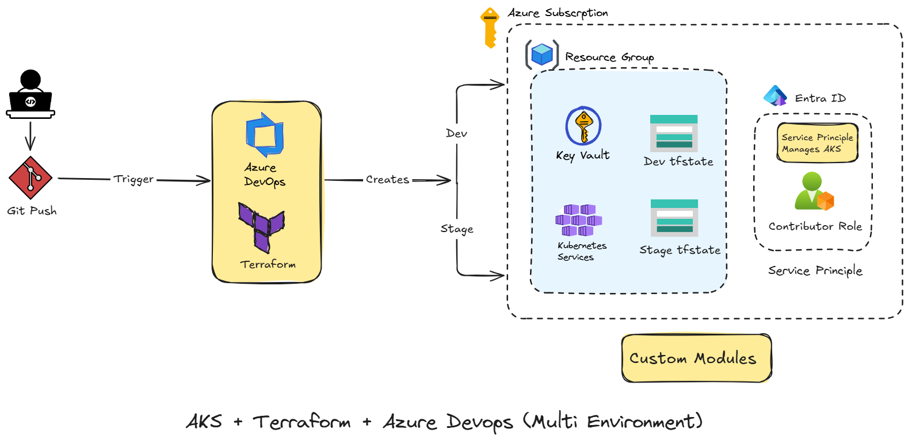

# Enterprise AKS Platform

## Project Overview

Enterprise AKS Platform is an Azure infrastructure and DevOps project focused on provisioning a multi-environment Azure Kubernetes Service platform using Terraform and Azure DevOps.

The project starts with infrastructure provisioning and will gradually evolve toward application deployment and GitOps.

The implementation will be written manually to build a strong understanding of Terraform, Azure, Azure DevOps, Kubernetes, and GitOps concepts.

## Current Architecture


## Project Goals

- Provision Azure infrastructure using Terraform.
- Maintain separate Dev and Staging environments.
- Build reusable Terraform modules.
- Store Terraform state remotely in Azure Storage.
- Automate Terraform operations through Azure DevOps Pipelines.
- Use Azure DevOps Service Connections for Azure authentication.
- Keep GitHub as the public source repository.
- Build the project incrementally and understand each component before automating it.

## Technology Stack

| Technology | Purpose |
|---|---|
| GitHub | Public source repository and version control |
| Azure DevOps | CI/CD pipelines |
| Terraform | Infrastructure as Code |
| Azure | Cloud platform |
| AKS | Kubernetes platform |
| Azure Key Vault | Secret management |
| Azure VNet | Network infrastructure |
| Azure Storage | Terraform remote state |
| Azure CLI | Backend bootstrap |
| PowerShell / Bash | Supporting scripts |

## Repository Structure

```text
enterprise-aks-platform/
|
+-- environments/
|   +-- dev/
|   +-- staging/
|
+-- modules/
|   +-- aks/
|   +-- key-vault/
|   +-- resource-group/
|   +-- vnet/
|
+-- scripts/
|   +-- setup-backend.sh
|
+-- screenshots/
|
+-- azure-pipelines.yml
+-- .gitignore
+-- README.md
```

## Terraform Design

The project uses reusable Terraform modules.

```text
modules/
|
+-- resource-group/
+-- vnet/
+-- aks/
+-- key-vault/
+-- storage-account/
```

Each module will contain its own:

```text
main.tf
variables.tf
outputs.tf
```

The environment folders will compose these modules.

For example:

```text
environments/dev/
    |
    +-- main.tf
    +-- providers.tf
    +-- variables.tf
    +-- outputs.tf
    +-- terraform.tfvars
    +-- backend.tf
```

The Staging environment will follow the same structure with environment-specific values.

## Terraform Backend

Terraform state will be stored remotely in Azure Storage.

The backend resources will be created using an Azure CLI bootstrap script before Terraform initialization.

Example design:

```text
terraform-state-rg
|
+-- Development Storage Account
|       |
|       +-- tfstate container
|
+-- Staging Storage Account
        |
        +-- tfstate container
```

The backend resources are kept outside the Terraform-managed infrastructure to avoid a bootstrap dependency.

## Development Approach

The project will be built in stages.

### Phase 1. Repository and Project Setup

- Create GitHub repository.
- Create Azure DevOps project.
- Connect GitHub to Azure DevOps.
- Create the initial repository structure.
- Configure `.gitignore`.
- Document the architecture.

### Phase 2. Terraform Modules

Build and test the modules individually.

Order:

1. Resource Group
2. Storage account
3. Virtual Network
4. Key Vault
5. AKS

Each module will be tested locally before moving to the next module.

### Phase 3. Environment Configuration

Create separate configurations for:

```text
Dev
Staging
```

Each environment will use the same reusable modules with different configuration values.

### Phase 4. Remote Terraform State

Create the Terraform backend resources using the bootstrap script.

Configure:

```text
Dev     -> dev state
Staging -> staging state
```

This prevents local Terraform state from being used as the source of truth.

### Phase 5. Local Validation

Before introducing CI/CD, Terraform will work locally through:

```bash
terraform init
terraform fmt
terraform validate
terraform plan
terraform apply
```

The goal is to confirm the infrastructure code works independently of Azure DevOps.

### Phase 6. Azure DevOps Pipeline

Once local provisioning works, automate the same workflow through Azure DevOps.

Initial pipeline flow:

```text
Git Push
    |
    v
Azure DevOps Pipeline
    |
    +-- Terraform Init
    |
    +-- Terraform Format Check
    |
    +-- Terraform Validate
    |
    +-- Terraform Plan
    |
    +-- Approval
    |
    +-- Terraform Apply
```

The pipeline will use an Azure DevOps Service Connection to authenticate with Azure.

### Phase 7. Multi-Environment Deployment

The pipeline will eventually support:

```text
Commit
  |
  v
Terraform Validate
  |
  v
Terraform Plan - Dev
  |
  v
Terraform Apply - Dev
  |
  v
Approval
  |
  v
Terraform Plan - Staging
  |
  v
Terraform Apply - Staging
```

## Future Expansion

After infrastructure provisioning works reliably, the project will expand into application delivery.

### Azure Container Registry

Add ACR for container image storage.

```text
Application
    |
    v
Docker Build
    |
    v
Azure Container Registry
    |
    v
AKS
```

### Kubernetes Application Deployment

Add Kubernetes manifests or Helm charts for deploying a sample application to AKS.

### Argo CD and GitOps

Introduce Argo CD after the Kubernetes deployment workflow is understood.

Target flow:

```text
GitHub
    |
    v
Argo CD
    |
    v
AKS
```

Argo CD will monitor the desired Kubernetes state in Git and synchronize the AKS cluster.

### Monitoring and Security

Future additions include:

- Azure Monitor
- Log Analytics
- Diagnostic Settings
- Managed Identity
- Key Vault integration
- Kubernetes RBAC
- Azure RBAC
- Application health monitoring

## Target Architecture

The final version is planned to evolve toward:

```text
                         GitHub
                            |
                            v
                    Azure DevOps
                            |
                     +------+------+
                     |             |
                  Terraform     CI/CD
                     |             |
                     v             v
              Azure Infrastructure  ACR
                     |              |
        +------------+------------+ |
        |            |            | |
       VNet         AKS       Key Vault
                     |
                     v
                  Argo CD
                     |
                     v
               Kubernetes App
                     |
                     v
             Monitoring / Logs
```

## Engineering Principles

- Infrastructure is defined as code.
- Environments remain isolated.
- Terraform modules are reusable.
- Secrets are not hardcoded.
- Terraform state is stored remotely.
- GitHub remains the source repository.
- Azure DevOps handles CI/CD.
- Changes are reviewed through Git commits.
- Infrastructure is tested locally before pipeline automation.
- New platform components are added only after the underlying concepts are understood.

## Project Outcome

The final project will demonstrate an end-to-end Azure DevOps and cloud platform workflow:

```text
Git
 |
 v
Azure DevOps
 |
 v
Terraform
 |
 v
Azure Infrastructure
 |
 v
AKS
 |
 v
Container Registry
 |
 v
Argo CD
 |
 v
Kubernetes Application
 |
 v
Monitoring
```

The project starts with Infrastructure as Code and gradually evolves into a complete Azure platform engineering workflow.
